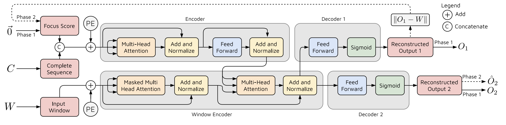
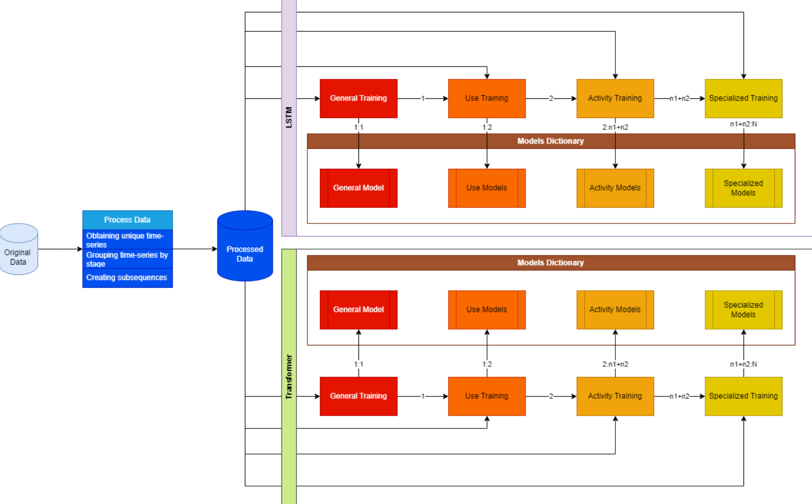
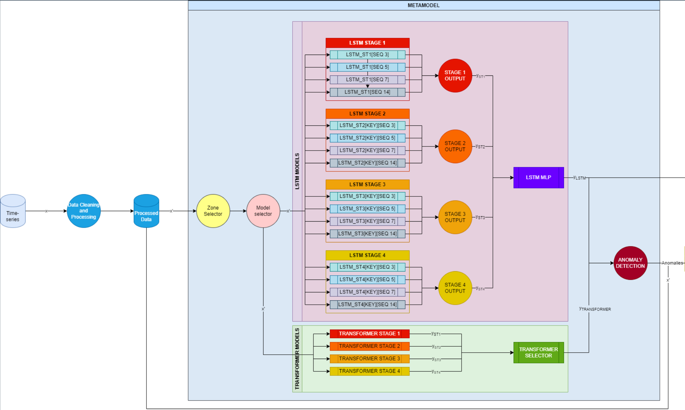
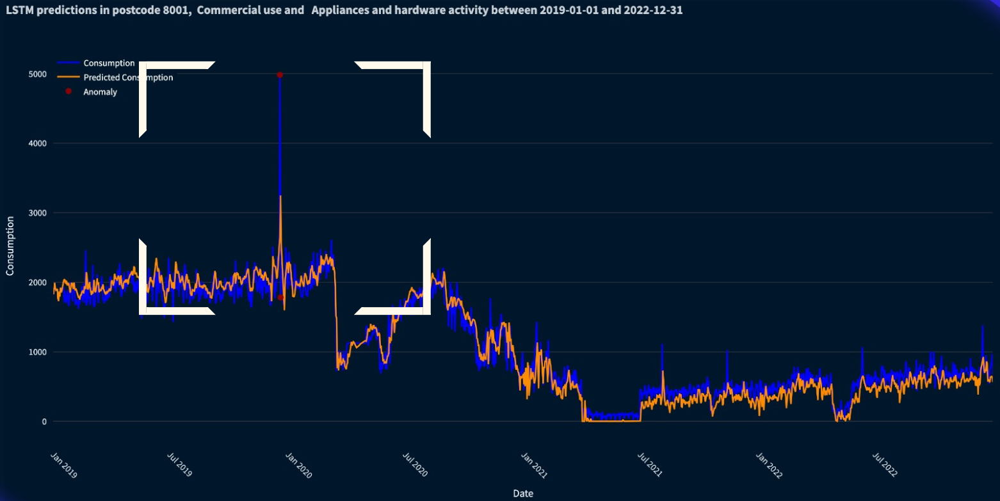
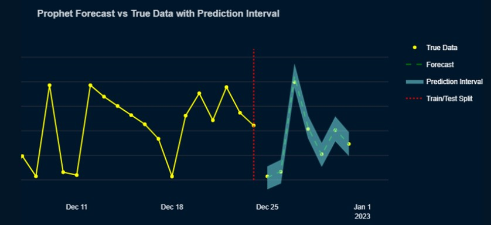
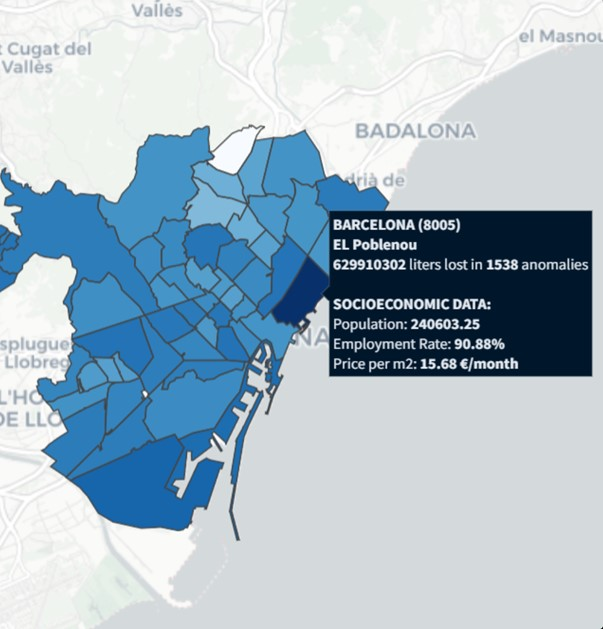

# Anomaly-Detection-Meta-Model
This project presents a hierarchical deep learning meta-model for water consumption anomaly detection. The model leverages LSTMs and Transformers to effectively recognize patterns, detect anomalies, and classify consumption behaviors. Additionally, a web application is developed to visualize the analyzed water consumption data. The implemented model achieves high accuracy in predicting consumption for various time series data.

This project is being used in an active contest, for confidentiality reasons, it will remain private. Contact to me if interested. Some of the most relevant features are highlighted in the following visualizations.

## Transformer AD architecture

## Hierarchical Training procedure

## WebApp visualization of anomaly detection using the model

## Web App visualization of our consumption prediction model

 
## Web App map visualization of the anomalies
 
